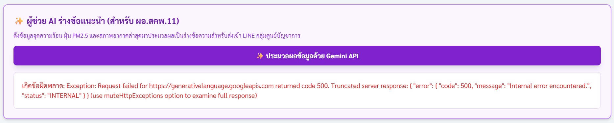

# หน้าจอที่ส่งมาคือข้อผิดพลาดรหัส 503 Service Unavailable
</img>

ข้อความ "This model is currently experiencing high demand" หมายความว่า เซิร์ฟเวอร์ของ Gemini API กำลังมีผู้ใช้งานหนาแน่นมากในขณะนี้ ทำให้ระบบฝั่งเซิร์ฟเวอร์ประมวลผลไม่ทันและไม่สามารถรับคำสั่งเพิ่มได้ชั่วคราว ปัญหานี้ไม่ได้เกิดจากโค้ดผิดพลาดแต่อย่างใด

## วิธีแก้ไขเบื้องต้น
ปัญหานี้มักเป็นปัญหาชั่วคราวที่เกิดขึ้นในช่วงสั้น ๆ ให้เว้นระยะรอสัก 1-2 นาที แล้วลองกดปุ่ม "ประมวลผลข้อมูลด้วย Gemini API" ใหม่อีกครั้ง

## แนวทางปรับปรุงระบบให้เสถียรขึ้นในระยะยาว
เพื่อให้ระบบทำงานได้ไหลลื่นและไม่แสดงข้อความ Error ดิบๆ ยาว ๆ แบบนี้บนหน้าจอ จึงเข้าไปปรับแก้โค้ดฝั่งหลังบ้าน (Google Apps Script) 2 ส่วน

1. เพิ่มพารามิเตอร์ muteHttpExceptions: true ในคำสั่ง UrlFetchApp.fetch() เพื่อดักจับ Error กลับมาแปลงเป็นข้อความภาษาไทยแจ้งเตือนผู้ใช้งานแบบสุภาพ เช่น "ขณะนี้เซิร์ฟเวอร์ AI มีผู้ใช้งานหนาแน่น โปรดลองใหม่อีกครั้งในภายหลัง"
2. สร้างระบบสู้ไม่ถอย (Auto-Retry) ในฝั่ง Apps Script ให้พยายามเรียก Gemini API ซ้ำอัตโนมัติสัก 2-3 รอบหากเจอ Error 503
