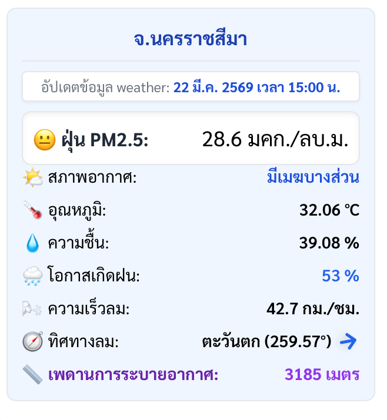

# ความเร็วลม
</img>

วันที่ 22 มีนาคม 2569 เวลา 15:00 น. ตัวเลขความเร็วลม 42.7 กม./ชม. (เทียบเท่าประมาณ 11.8 เมตร/วินาที หรือลมระดับ 6 ตามมาตราโบฟอร์ต) ถือว่าเป็นลมที่มีกำลัง "แรง" กว่าปกติสำหรับพื้นที่บนบกอย่างโคราช 

แต่จากข้อมูลแวดล้อมบนหน้าจอ "ไม่ใช่ข้อผิดพลาดของระบบหรือการคำนวณโค้ด"  (สูตรแปลงหน่วย ws10m * 3.6 ทำงานถูกต้อง) แต่เป็นตัวเลขที่สะท้อนปรากฏการณ์ทางอุตุนิยมวิทยาที่กำลังจะเกิดขึ้น โดยมีจุดสังเกตที่สอดคล้องกัน 3 ประการ:
1. สัญญาณของพายุฤดูร้อน (Summer Storm): "โอกาสเกิดฝน" พุ่งสูงถึง 53% ในช่วงเดือนมีนาคมที่อากาศร้อนจัด (32.06 °C) เมื่อมีความชื้นเข้ามาปะทะ มักจะทำให้เกิดฝนฟ้าคะนองรุนแรง และสิ่งที่จะมาก่อนฝนก็คือ "ลมกระโชกแรง" (Wind Gusts) หรือพายุลมแรง ซึ่งแบบจำลองของกรมอุตุนิยมวิทยาสามารถตรวจจับและพยากรณ์ลมกระโชกนี้ได้
2. เพดานการระบายอากาศที่สูงลิ่ว (BLH): ค่า BLH ที่สูงทะลุ 3,185 เมตร บ่งบอกถึงอากาศร้อนผิวดินที่กำลังยกตัวตั้งฉากขึ้นสู่อากาศเบื้องบนอย่างรุนแรง (Strong Convection) ซึ่งการยกตัวรุนแรงนี้ เป็นกลไกหลักในการดึงเอาลมพายุเข้ามาแทนที่
3. ผลกระทบต่อ PM2.5: ลมกระโชกแรงระดับ 42 กม./ชม. บวกกับเพดานอากาศที่เปิดโล่งกว่า 3 กิโลเมตร ทำหน้าที่เหมือน "เครื่องดูดและเป่าฝุ่นขนาดยักษ์" พัดพากลุ่มควันกระจายออกนอกพื้นที่อย่างรวดเร็ว เป็นเหตุผลที่ค่าฝุ่น PM2.5 ปัจจุบันของโคราชตกลงมาอยู่ในระดับสีเหลือง (28.6 มคก./ลบ.ม.)

สรุปคือ ระบบนี้ กำลังแสดงให้เห็นถึง "สภาพอากาศสุดขั้ว" (Extreme Weather) ณ ช่วงเวลานั้นพอดี ข้อมูลชุดนี้เตือนให้ระวังเรื่องพายุลมแรงและฝนฟ้าคะนองในพื้นที่ได้
